# Matching Service UML Class Diagram

```mermaid
classDiagram
    direction TB

    %% Service Layer
    class Service {
        +handler Handler
        +Start()
        +Stop()
    }

    class Handler {
        +engine Engine
        +AddWorkflowTask()
        +AddActivityTask()
        +PollWorkflowTaskQueue()
        +PollActivityTaskQueue()
        +QueryWorkflow()
    }

    %% Engine Layer
    class Engine {
        <<interface>>
        +AddWorkflowTask()
        +AddActivityTask()
        +PollWorkflowTaskQueue()
        +PollActivityTaskQueue()
        +GetTaskQueueUserData()
    }

    class matchingEngineImpl {
        -partitions map~taskQueuePartitionManager~
        -taskManager persistence.TaskManager
        -historyClient HistoryServiceClient
        -matchingRawClient MatchingServiceClient
        -config Config
        +getTaskQueuePartitionManager()
        +unloadTaskQueuePartition()
    }

    %% Partition Manager Layer
    class taskQueuePartitionManager {
        <<interface>>
        +AddTask()
        +PollTask()
        +GetUserDataManager()
        +LegacyDescribeTaskQueue()
    }

    class taskQueuePartitionManagerImpl {
        -engine Engine
        -partition tqid.Partition
        -config Config
        -defaultQueue physicalTaskQueueManager
        -versionedQueues map~physicalTaskQueueManager~
        -userDataManager userDataManager
        +getPhysicalQueue()
    }

    %% Physical Queue Manager Layer
    class physicalTaskQueueManager {
        <<interface>>
        +Start()
        +Stop()
        +AddTask()
        +PollTask()
        +SpoolTask()
        +HasBackloggedTasks()
    }

    class physicalTaskQueueManagerImpl {
        -queue PhysicalTaskQueueKey
        -config Config
        -backlogMgr backlogManager
        -matcher TaskMatcher
        -priMatcher priTaskMatcher
        -liveness liveness
    }

    %% Task Matcher Layer
    class TaskMatcher {
        -config Config
        -fwdr Forwarder
        -taskC chan~internalTask~
        -queryTaskC chan~internalTask~
        +Offer()
        +OfferQuery()
        +MustOffer()
        +Poll()
    }

    class priTaskMatcher {
        -config Config
        -fwdr priForwarder
        -data matcherData
        -readyCond sync.Cond
        +AddTask()
        +AddPoller()
        +WaitForTask()
    }

    class matcherData {
        -taskQueues taskPQ
        -pollerQueues pollerPQ
        +addTask()
        +addPoller()
        +waitingPollerCount()
        +backloggedTaskCount()
    }

    %% Backlog Manager Layer
    class backlogManager {
        <<interface>>
        +Start()
        +Stop()
        +SpoolTask()
        +BacklogStatus()
        +TasksRemaining()
    }

    class backlogManagerImpl {
        -taskQueueDB taskQueueDB
        -taskWriter taskWriter
        -taskReader taskReader
        -ackManager ackManager
        -outstandingTasksLimit int
    }

    %% Persistence Layer
    class taskQueueDB {
        +CreateTasks()
        +CompleteTasksLessThan()
        +GetTasks()
        +UpdateState()
    }

    class taskWriter {
        -taskQueueDB taskQueueDB
        -appendCh chan~writeTaskRequest~
        +appendTask()
    }

    class taskReader {
        -taskQueueDB taskQueueDB
        -dispatchCh chan~internalTask~
        +getTaskBatch()
        +dispatchTasks()
    }

    class ackManager {
        -db taskQueueDB
        -backlogAge int64
        +addTask()
        +completeTask()
        +getAckLevel()
    }

    %% Forwarder Layer
    class Forwarder {
        -client MatchingServiceClient
        -taskQueueID tqid.TaskQueue
        +ForwardTask()
        +ForwardPoll()
        +ForwardQueryTask()
    }

    class priForwarder {
        -client MatchingServiceClient
        -partition tqid.Partition
        +StartForwarding()
        +ForwardTask()
        +ForwardPoll()
    }

    %% User Data Manager
    class userDataManager {
        <<interface>>
        +GetUserData()
        +UpdateUserData()
    }

    %% Rate Limit Manager
    class rateLimitManager {
        -partitionRateLimiter quotas.RateLimiter
        -dispatchRateLimiter quotas.RateLimiter
        +Wait()
    }

    %% Data Types
    class internalTask {
        +event persistencespb.TaskQueueInfo
        +responseC chan~syncMatchResponse~
        +isForwarded bool
        +isQuery()
        +isStarted()
        +finish()
    }

    class PhysicalTaskQueueKey {
        +Partition tqid.Partition
        +VersionSet string
        +TaskType TaskType
    }

    %% Relationships
    Service --> Handler : contains
    Handler --> Engine : uses
    Engine <|.. matchingEngineImpl : implements
    matchingEngineImpl --> taskQueuePartitionManager : manages *

    taskQueuePartitionManager <|.. taskQueuePartitionManagerImpl : implements
    taskQueuePartitionManagerImpl --> physicalTaskQueueManager : defaultQueue
    taskQueuePartitionManagerImpl --> physicalTaskQueueManager : versionedQueues *
    taskQueuePartitionManagerImpl --> userDataManager : uses

    physicalTaskQueueManager <|.. physicalTaskQueueManagerImpl : implements
    physicalTaskQueueManagerImpl --> backlogManager : uses
    physicalTaskQueueManagerImpl --> TaskMatcher : legacy
    physicalTaskQueueManagerImpl --> priTaskMatcher : new
    physicalTaskQueueManagerImpl --> rateLimitManager : uses

    priTaskMatcher --> matcherData : uses
    priTaskMatcher --> priForwarder : uses
    TaskMatcher --> Forwarder : uses

    backlogManager <|.. backlogManagerImpl : implements
    backlogManagerImpl --> taskQueueDB : uses
    backlogManagerImpl --> taskWriter : uses
    backlogManagerImpl --> taskReader : uses
    backlogManagerImpl --> ackManager : uses

    taskWriter --> taskQueueDB : writes to
    taskReader --> taskQueueDB : reads from
    ackManager --> taskQueueDB : updates
```



## 架构层次说明

### 1. 服务层 (Service Layer)
- **Service**: 服务入口,管理生命周期
- **Handler**: gRPC处理器,接收外部请求

### 2. 引擎层 (Engine Layer)
- **matchingEngineImpl**: 核心引擎,管理所有任务队列分区

### 3. 分区管理层 (Partition Manager Layer)
- **taskQueuePartitionManagerImpl**: 逻辑队列分区,管理多个物理队列

### 4. 物理队列层 (Physical Queue Layer)
- **physicalTaskQueueManagerImpl**: 物理队列,包含匹配器和积压管理

### 5. 任务匹配层 (Task Matcher Layer)
- **TaskMatcher**: 传统匹配器 (channel-based)
- **priTaskMatcher**: 新优先级匹配器 (priority queue-based)

### 6. 持久化层 (Persistence Layer)
- **backlogManager**: 积压管理,处理DB操作
- **taskWriter/taskReader/ackManager**: 读写和确认管理

## 核心流程

```
AddTask: Handler → Engine → PartitionManager → PhysicalQueueManager → Matcher/Backlog
PollTask: Handler → Engine → PartitionManager → PhysicalQueueManager → Matcher
```

---

## AddTask 流程图 (priTaskMatcher)


### AddTask 流程说明 (pri逻辑)

1. **入口**: History Service 通过 gRPC 调用 Matching Service
2. **路由**: Engine 根据 TaskQueue 名称和分区找到或创建 PartitionManager
3. **版本选择**: PartitionManager 根据 Worker 版本选择正确的物理队列
4. **同步匹配尝试**:
   - `priTaskMatcher.Offer` → `matcherData.MatchTaskImmediately`
   - 如果有等待的Poller,直接匹配交付
   - 如果匹配到TaskForwarder (子分区后台goroutine),任务被转发到父分区
5. **阻塞等待**: Root分区收到转发来的backlog任务会阻塞等待Poller
6. **持久化**: 同步匹配失败后,写入backlog,taskReader读取后调用`AddTask`加入匹配队列

---

## PollTask 流程图 (priTaskMatcher)


### 子分区后台 Goroutine


### PollTask 流程说明 (pri逻辑)

1. **入口**: Worker 通过 gRPC 长轮询 Matching Service
2. **创建Poller**: 创建 `waitingPoller` 包含转发上下文和元数据
3. **入队等待**: `matcherData.EnqueuePollerAndWait` 将Poller加入等待队列
4. **匹配机制**: matcherData 统一管理任务和Poller的匹配:
   - 如果有等待的任务,立即匹配返回
   - 否则Poller加入队列等待任务到达
5. **任务来源**:
   - **同步任务**: 通过 `Offer` 添加的任务
   - **Backlog任务**: taskReader 读取后通过 `AddTask` 添加
   - **转发任务**: 从子分区转发来的任务
6. **子分区转发**: 后台goroutine负责:
   - `forwardTasks`: 将本地backlog任务转发到父分区
   - `forwardPolls`: 将本地Poller转发到父分区获取任务
7. **过期检查**: 返回前检查任务是否过期,过期则丢弃继续等待

---

## 同步匹配机制 (matcherData)


### matcherData 核心数据结构

- **taskQueues (taskPQ)**: 等待匹配的任务优先级队列
- **pollerQueues (pollerPQ)**: 等待任务的Poller优先级队列
- **关键方法**:
  - `MatchTaskImmediately`: 快速路径,尝试立即匹配
  - `EnqueueTaskAndWait`: 任务入队并阻塞等待Poller
  - `EnqueuePollerAndWait`: Poller入队并阻塞等待任务
  - `EnqueueTaskNoWait`: Backlog任务入队不阻塞

同步匹配是 Matching Service 的核心优化:
- 当任务和 Poller 同时存在时,直接匹配,跳过数据库
- 大幅降低任务调度延迟
